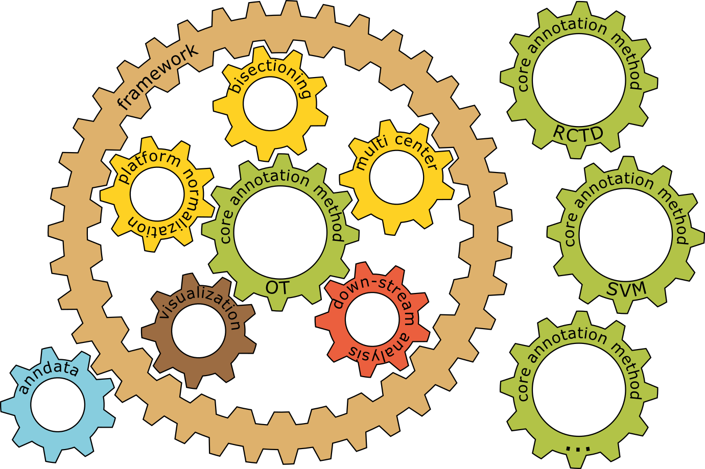

..
   Note: Items in this toctree form the top-level navigation. See `api.rst` for the `autosummary` directive, and for why `api.rst` isn't called directly.

.. toctree::
   :hidden:

   Home <self>
   Examples <examples>
   API reference <_autosummary/tacco>
   Release Notes <release_notes>
   References <references>

Welcome to the TACCO documentation!
===================================

TACCO Library
-------------
	

The Python module TACCO is a self-contained annotation-centered framework providing tools from preprocessing to analysis and visualization of the annotations. It integrates easily into the existing Scanpy-based bioinformatics ecosystem [Wolf18]_ as it works on the same data structures and shares the known module structure into sub-modules, e.g. :mod:`tacco.pp <tacco.preprocessing>`, :mod:`tacco.tl <tacco.tools>`, and :mod:`tacco.pl <tacco.plots>`, containing basic and advanced functionality and plotting capabilities.

Aside from these standard sub-modules there is an extra sub-module :mod:`tacco.utils`, containing optimized math routines, wrappers for dense and sparse BLAS-based functionality, dense and sparse distance calculations that are orders of magnitude faster than the standard scipy methods, and a sparsity optimized implementation of the Sinkhorn-Knopp matrix scaling algorithm. This module is the computational core of TACCO and the basis of all integrated fast annotation methods.

As a framework TACCO also provides a common interface for annotation, which can be used not just with the annotation methods integrated directly in TACCO, but with a broad set of other annotation methods in order to use all the high-level functionality provided for integrated methods. TACCO already comes with many wrappers for third party methods, e.g. for Tangram [Biancalani20]_ and RCTD [Cable21]_, which can serve as examples for how to wrap methods implemented both in python and R. Some methods do not have cell-type fractions as output, but a differently normalized mapping between types or cells and space or bead, which does not include information about the absolute cell type fractions (e.g. Tangram and NovoSpaRc [Nitzan19]_). These methods can still be wrapped using the pseudo-bulk cell-type fractions of the reference data - their results for cell-type fractions, especially in comparison to other more direct methods, have to be taken with a grain of salt.

An overview of TACCO can also be found in the accompanying manuscript [Mages23]_.

How to install TACCO
--------------------

Up to date installation instructions are available in the README of the `TACCO repository <https://github.com/simonwm/tacco#how-to-install-tacco>`_.

How to use TACCO
----------------

Apart from the quickstart in the README of the `TACCO repository <https://github.com/simonwm/tacco#how-to-use-tacco>`_, there are :doc:`examples <examples>` for selected use cases which are backed by their own `repository <https://github.com/simonwm/tacco_examples>`_.
